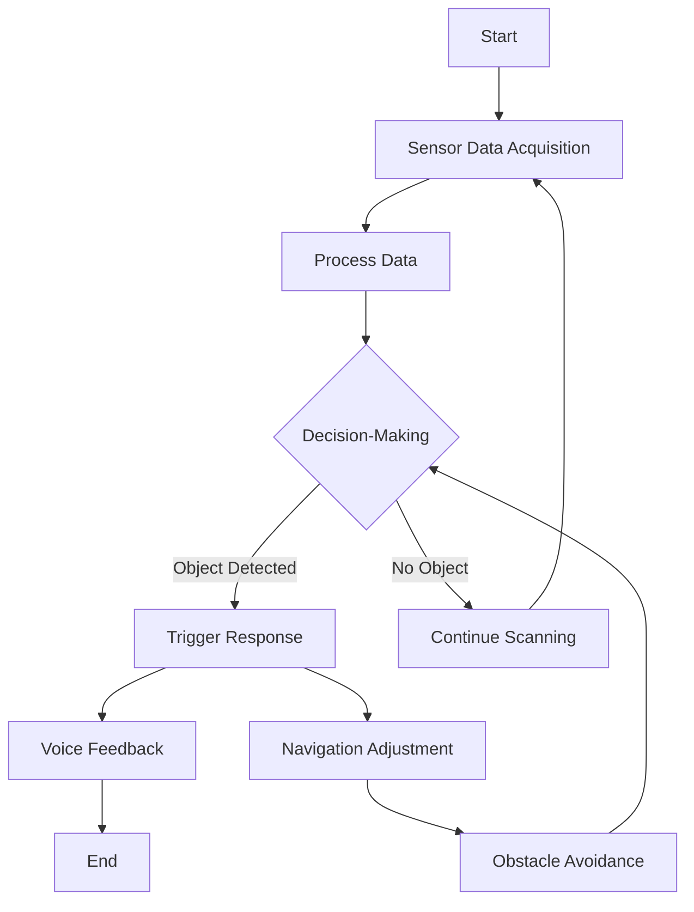
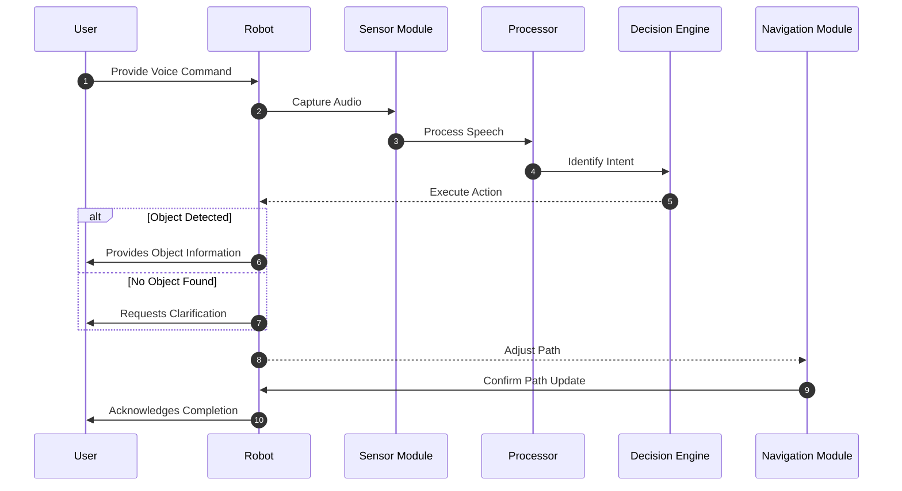

## Overview of Workflow 



## System Interaction Flow



## State Transitions in Navigation

```mermaid
stateDiagram-v2
  state scan_state <<fork>>
    [*] --> scan_state
    scan_state --> Object_Detected
    scan_state --> No_Object

    state decision_state <<join>>
    Object_Detected --> decision_state
    No_Object --> decision_state
    decision_state --> Navigate
    Navigate --> [*]
