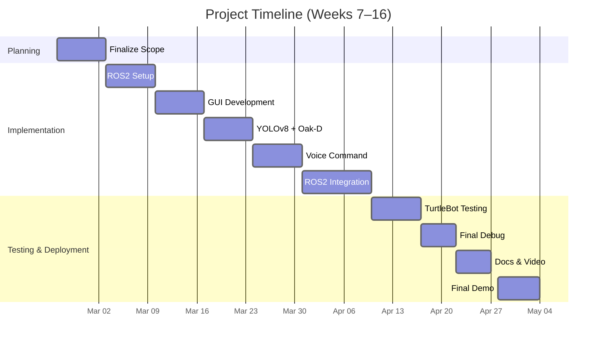
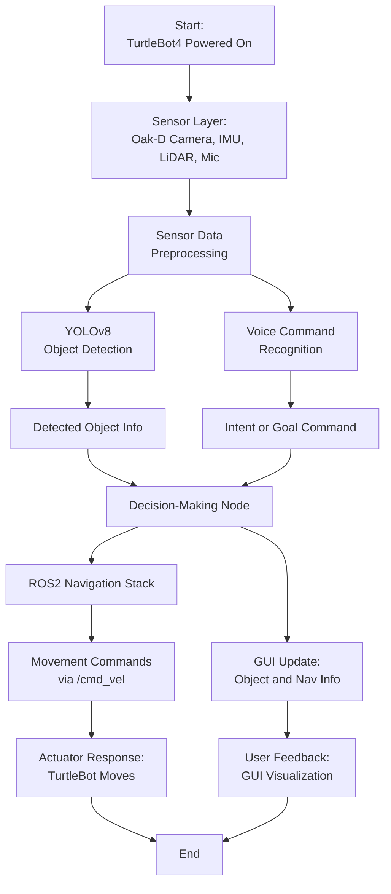
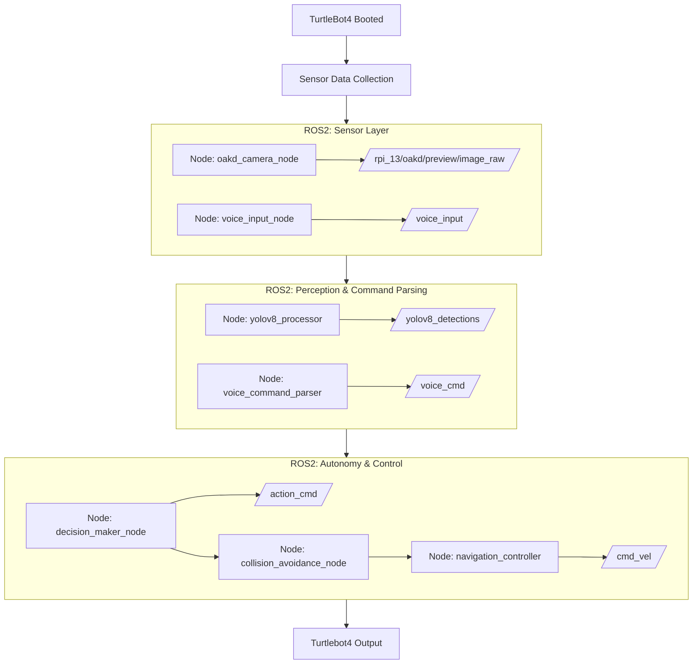
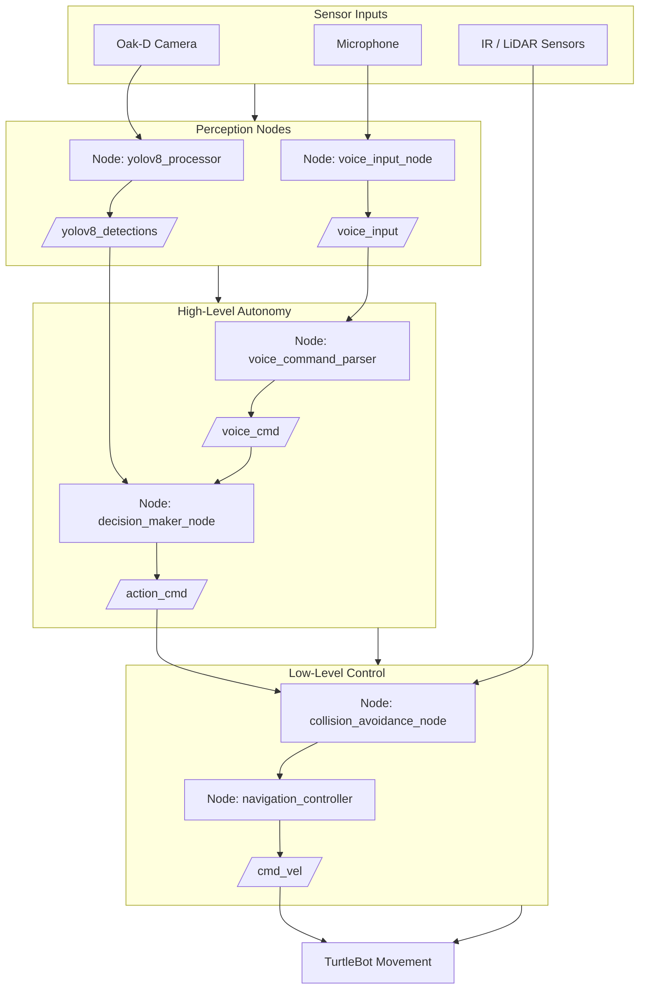
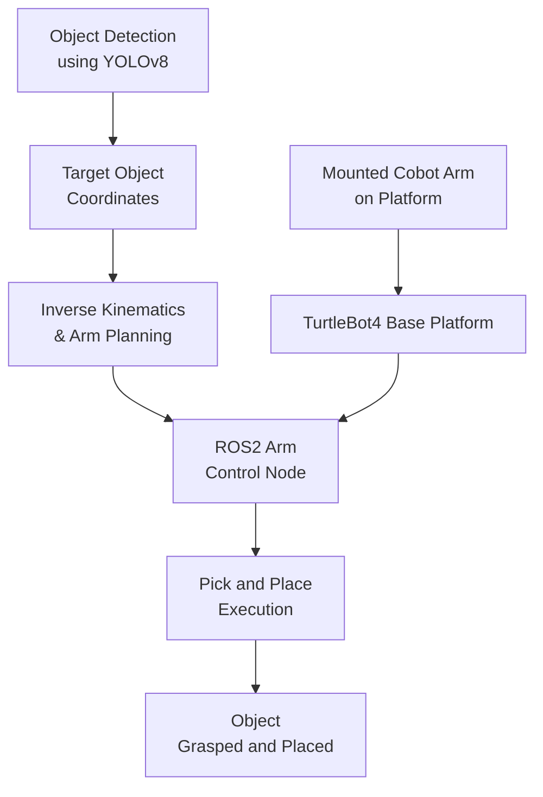

## Project Visual Overview

| Section              | Chart Title                                | Description                                                                 |
|----------------------|---------------------------------------------|-----------------------------------------------------------------------------|
| **Timeline**        | Gantt Chart                                 | Shows weekly project phases from planning to deployment.                    |
| **Workflow**        | Project Workflow Chart                      | Displays the full robot pipeline from sensor data to GUI feedback.          |
| **System Control**  | System Architecture + ROS2 Nodes & Topics  | Visualizes ROS2 nodes and topics, including collision avoidance logic.      |
| **Future Work**     | Cobot Arm Integration Flow                  | Outlines the proposed pick-and-place functionality using a mounted arm.     |

## Gantt Chart – Project Timeline Overview

## Main Project Pipeline 

- The flowchart below represents the overall working of our Intelligent TurtleBot4 system. 
- It starts with sensor data collection from the Oak-D camera, IMU, LiDAR, and microphone. 
- The data is then preprocessed and sent to two parallel modules: YOLOv8 for object detection and voice recognition for interpreting commands.

- Outputs from both modules are fed into a decision-making node that determines the robot's next action. 
- The chosen action is executed via the ROS2 navigation stack and published as movement commands. 
- Simultaneously, the GUI updates with relevant feedback, allowing users to visualize object info and robot behavior in real time.

---

## System Control and Autonomy Flow

- The diagram below presents the complete decision and control loop of our TurtleBot4 system.
- From user voice inputs and real-time camera feeds, data is collected, processed, and passed through an autonomy layer to issue movement commands.
- Each subsystem (sensor, processing, autonomy) is driven by dedicated ROS2 nodes communicating through standard topics.

---
## Hybrid ROS2 System Architecture

- This diagram separates high-level autonomy (top row) from low-level motion control (bottom row), with clearly labeled ROS2 nodes and topic communication.
- It maintains modular blocks for perception, decision-making, and actuation while improving visual alignment and clarity.

---

## Future Work Concept: TurtleBot4 with Mounted Cobot Arm

This future work visual outlines the integration of a robotic arm on TurtleBot4. 
The system uses object detection and coordinates from the perception pipeline to compute inverse kinematics and execute pick-and-place actions via a dedicated ROS2 control node.

Goals to Capture Visually:
- Addition of a robotic arm mounted on TurtleBot4
- Use of ROS2 for communication with the arm
- Performing pick-and-place tasks
- Integration with existing perception (e.g., YOLOv8 object detection for picking targets)

---

