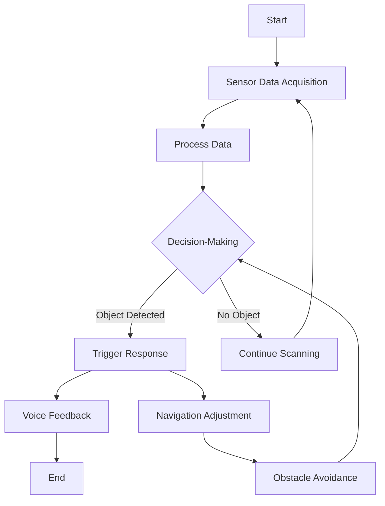
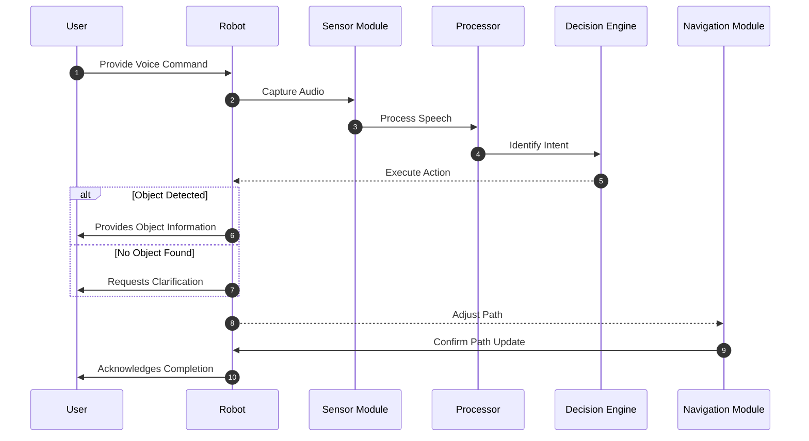
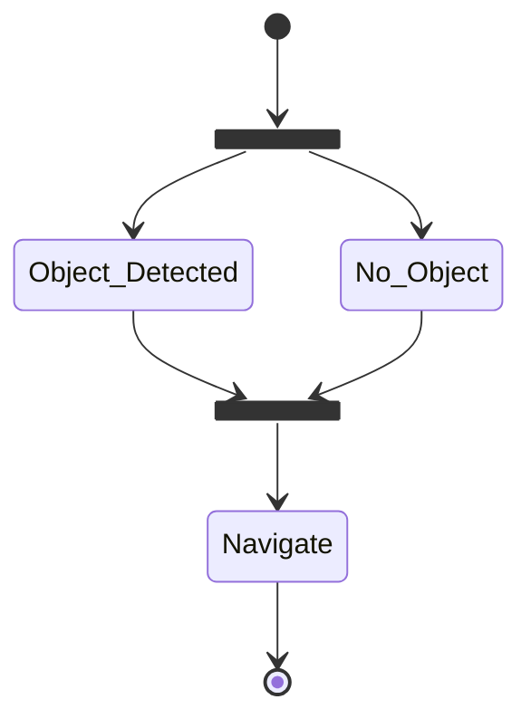
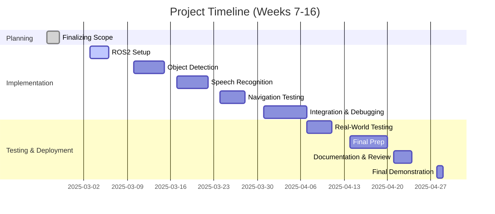

## Overview of Workflow 

```mermaid
graph TD
  A[Start] --> B[Sensor Data Acquisition]
  B --> C[Process Data]
  C --> D{Decision-Making}
  D -->|Object Detected| E[Trigger Response]
  D -->|No Object| F[Continue Scanning]
  E --> G[Voice Feedback]
  E --> H[Navigation Adjustment]
  H --> I[Obstacle Avoidance]
  I --> D
  G --> J[End]
  F --> B
```

## System Interaction Flow

```mermaid
sequenceDiagram
  autonumber
  User->>Robot: Provide Voice Command
  Robot->>Sensor Module: Capture Audio
  Sensor Module->>Processor: Process Speech
  Processor->>Decision Engine: Identify Intent
  Decision Engine-->>Robot: Execute Action
  alt Object Detected
      Robot->>User: Provides Object Information
  else No Object Found
      Robot->>User: Requests Clarification
  end
  Robot-->>Navigation Module: Adjust Path
  Navigation Module->>Robot: Confirm Path Update
  Robot->>User: Acknowledges Completion
```

## State Transitions in Navigation

```mermaid
stateDiagram-v2
  state scan_state <<fork>>
    [*] --> scan_state
    scan_state --> Object_Detected
    scan_state --> No_Object

    state decision_state <<join>>
    Object_Detected --> decision_state
    No_Object --> decision_state
    decision_state --> Navigate
    Navigate --> [*]
```

---
## Gantt Chart Representation 

```mermaid
gantt
    title Project Timeline (Weeks 7-16)
    dateFormat  YYYY-MM-DD
    section Planning
    Finalizing Scope :done, milestone1, 2025-02-24, 2d
    section Implementation
    ROS2 Setup :active, milestone2, 2025-03-03, 3d
    Object Detection :milestone3, 2025-03-10, 5d
    Speech Recognition :milestone4, 2025-03-17, 5d
    Navigation Testing :milestone5, 2025-03-24, 4d
    Integration & Debugging :milestone6, 2025-03-31, 7d
    section Testing & Deployment
    Real-World Testing :milestone7, 2025-04-07, 4d
    Final Prep :milestone8, 2025-04-14, 6d
    Documentation & Review :milestone9, 2025-04-21, 3d
    Final Demonstration :milestone10, 2025-04-28, 1d
```
