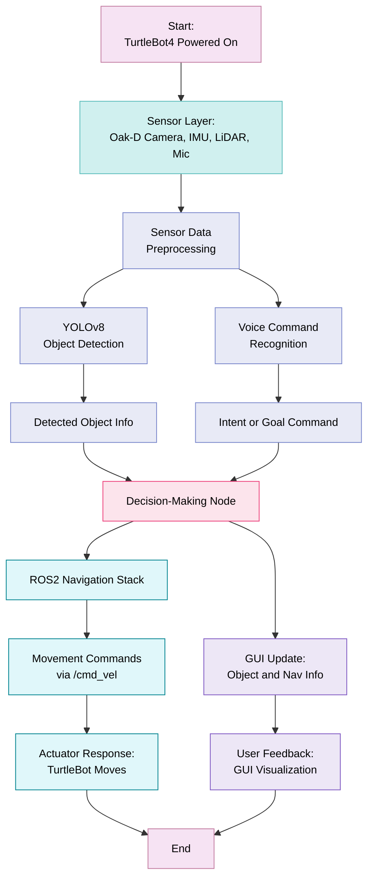
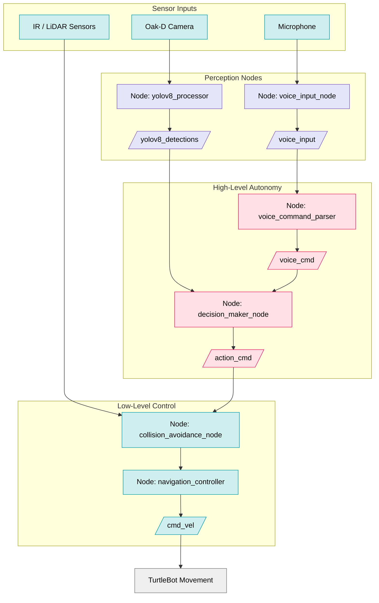
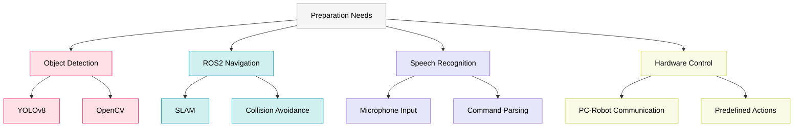
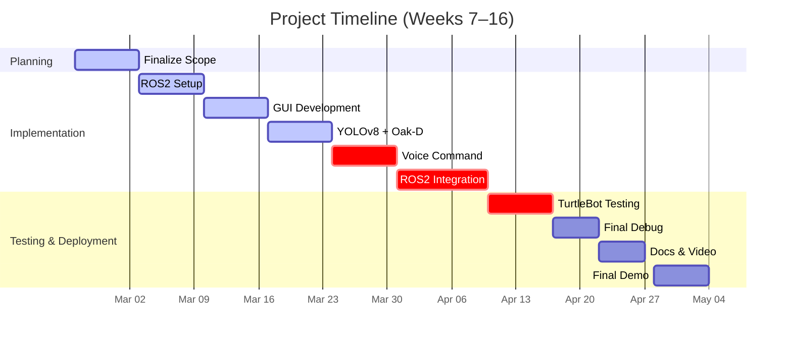

## Team Information

- **Project Name:** Intelligent TurtleBot: Deep Learning-Based Object Detection and Voice-Guided Navigation
- **Team Number:** 11
- **Team Members:** Anushka Gangadhar Satav, Adithya Konda, Sameerjeet Singh Chhabra
- **Semester:** Spring 2025
- **University:** Arizona State University
- **Class:** RAS 598 Experimentation and Deployment of Robots
- **Professor:** Dr. Dan Aukes
- **Email:** anushka.satav@asu.edu, akonda5@asu.edu, schhab18@asu.edu

---
## Project Plan

> Research Question: 
> How can a mobile robot effectively combine vision, speech, and autonomous navigation to create a responsive and interactive system in real-world environments?

**Concept:** 

This project explores how TurtleBot4 can intelligently interact with its surroundings through vision-based object detection and voice-guided navigation. Using TurtleBot 4 with Create 3 and Raspberry Pi, our aim is to integrate and demonstrate the following capabilities:

- Real-time object detection using YOLOv8, recognizing and categorizing environmental objects with live camera input.
- Voice command interaction, allowing users to issue spoken instructions that influence robot behavior through a natural interface.
- Autonomous navigation with obstacle avoidance using the ROS2 navigation stack, enabling safe and efficient mobility.
- Decision-making based on perception, where voice commands and visual detections combine to guide task execution.
- Fallback mechanisms to ensure robustness and handle unexpected failures in hardware or software modules.
---

This updated scope aligns directly with our project deliverables — voice-guided, vision-aware autonomous robot control — and leaves room for seamless extension into manipulation and complex task planning.

---
## Project Workflow

The system operates by capturing data from multiple sensors, interpreting user commands, and performing autonomous navigation and feedback. The diagram below outlines the overall data and control flow of the TurtleBot4 system.

---
## Project Discussions
### 1. Sensor Fusion and Autonomous Decision-Making

The TurtleBot4 system leverages multiple data sources — including vision, audio, and LiDAR — to perform real-time perception and intelligent control. 
These data streams are handled through modular ROS2 nodes that contribute to both high-level autonomy and low-level motion control.

### 2. Sensor Inputs

- **Oak-D Camera** provides real-time RGB images for visual perception.
- **Microphone** captures user voice commands as audio input.
- **LiDAR and IR sensors** are used for obstacle detection and collision avoidance.

These sensors operate concurrently and feed their outputs into dedicated ROS2 nodes.

### 3. Perception and Processing Nodes

- `yolov8_processor`: Subscribes to image streams (`/rpi_13/oakd/preview/image_raw`) and outputs detected object data to `/yolov8_detections`.
- `voice_input_node`: Processes raw audio and converts it into structured voice data (`/voice_input`).
- `voice_command_parser`: Transforms audio into semantic commands (e.g., "move forward") and publishes them to `/voice_cmd`.

This layered perception setup allows the robot to understand both its **physical environment** and **human intent** simultaneously.

#### 3.1 High-Level Autonomy

The core decision-making logic resides in the `decision_maker_node`, which:

- Consumes outputs from both `/yolov8_detections` and `/voice_cmd`
- Prioritizes user commands or detected objects to determine the appropriate action
- Publishes resulting commands to `/action_cmd`

#### 3.2 Low-Level Motion Control

Low-level execution is handled by the following:

- `collision_avoidance_node`: Merges `/action_cmd` with real-time sensor data (e.g., LiDAR) to determine safe trajectories
- `navigation_controller`: Translates the motion plan into velocity commands published to `/cmd_vel`

These nodes form a closed-loop controller that ensures both **goal-directed behavior** and **safety**.

---

### 4. ROS2 and GUI

The graphical user interface (GUI) acts as a crucial feedback layer between perception, autonomy, and user interaction. It helps visualize how the robot interprets its environment, processes inputs, and executes decisions.

---

#### 4.1 GUI Integration Overview

The GUI provides live visualization of:

- Real-time video feed with bounding boxes from YOLOv8 detections
- Voice command recognition status and interpreted actions
- Robot's velocity, heading, and navigation path
- Sensor diagnostics such as LiDAR, IMU, and hazard detection

ROS2 topics connected to the GUI include:

- `/yolov8_detections` – Object detection overlays
- `/voice_cmd` – Recognized voice command topics
- `/cmd_vel` – Velocity control signals
- `/rpi_13/hazard_detection` – Safety monitoring
- `/rpi_13/imu` – IMU motion feedback

---

#### 4.2 GUI Layout & Design Concepts

**Initial Mockup using Inkscape**  

**Proposed Interactive GUI for ROS2 Integration**  

These GUI designs aim to present important real-time system data in an intuitive and user-friendly format, enabling both operator awareness and effective debugging.

---

#### 4.3 Live Sensor Visualization in GUI

The GUI aggregates multiple sensor streams into a unified dashboard. Key visualized components:

- **Object Detection Feed:**  
  Annotated Oak-D camera frames showing bounding boxes and labels.
  
- **Voice Command Status:**  
  Display of the latest interpreted command and its mapped action.
  
- **Navigation Planner View:**  
  Real-time trajectory paths generated by the navigation stack.
  
- **Sensor Diagnostics:**  
  Live data from LiDAR, IMU, and hazard modules.

---

#### 4.4 GUI Demonstration Video

**Test 01: Object Detection + GUI Overlay**

  
*Real-time object detection using YOLOv8 with GUI overlay showing detected objects and confidence scores.*

---

#### _Additional Demonstration Videos_

**Test 02: Voice Command Navigation *(Coming Soon)***

  

_A short demo showcasing voice-command-based control of TurtleBot4 in a dynamic environment._

**Test 03: Full Autonomy Simulation *(Planned)***

  

_A future test combining voice input, object detection, and autonomous navigation on real hardware._

---
## 4.5 Control Architecture in ROS2

The following flowchart summarizes the control pipeline, organized by data type and decision layer:

## Interaction Mechanism

**Behavioral Influence & Interfaces**

- **Voice Command API**: Users instruct the robot using predefined phrases.
- **ROS2 RQT GUI/Web Dashboard**: For remote monitoring.

*(Include a professional-looking UI sketch showing how users will interact with the system.)*

---
## Preparation Needs

### Required Knowledge & Topics for Success

---
## Final Demonstration Plan

### Setup & Execution

- **Classroom Resources**: Open space for navigation demo.
- **Demonstration Steps**: The robot will identify objects, respond to user queries, navigate obstacles, and execute spoken commands.

### Handling Environmental Variability (future scope)

- **Adaptive Algorithms**: Adjust object detection thresholds dynamically.
- **Fallback Modes**: If detection fails, switch to manual control or alternative recognition models.

### Testing & Evaluation Plan

- **Simulated Testing in Gazebo** before real-world deployment.
- **Comparison Metrics**:
  - Object recognition accuracy.
  - Speech command response time.
  - Navigation success rate.

---
## Impact

This project will:

- Advance AI-driven robotics interactions for smart environments.
- Develop speech-integrated autonomous systems.
- Provide students hands-on experience with ROS2, AI, and embedded systems.
- Potentially contribute to assistive robotics research.
---

---

### Future Scope:

In future iterations, the system can be extended with:

- Robotic arm integration mounted on TurtleBot4 for executing pick-and-place actions based on detected objects.
- Task-oriented planning using semantic understanding of scenes (e.g., pick red object and place it near the wall).

Here is the generated image of a cobot mounted on a TurtleBot4 using CHATGPT 4o

## References *(Subject to change)*:

1. Deep Learning model options: https://yolov8.com/
2. YOLOv8 example: https://rs-punia.medium.com/building-a-real-time-object-detection-and-tracking-app-with-yolov8-and-streamlit-part-1-30c56f5eb956
3. Speech Recognition Libraries: https://pypi.org/project/SpeechRecognition/
4. Turtlebot4 Mapping Resource: https://turtlebot.github.io/turtlebot4-user-manual/tutorials/generate_map.html
5. Mapping, Localizing, Path planning packages for Turtlebot4: https://turtlebot.github.io/turtlebot4-user-manual/tutorials/turtlebot4_navigator.html

---
## Advising & Resources

### Project Advisor

- **Dr. Daniel Aukes** 
- **Resource Needs**: Hardware support, mentorship on TurtleBot4 Hardware integration with ROS2.

---
# Weekly Milestones (Weeks 7-16)

## Weekly Milestones (Weeks 7–16)

| **Week**   | **Date**         | **Milestone**                                                           | **Status**        |
|------------|------------------|-------------------------------------------------------------------------|-------------------|
| **Week 7** | Feb 24, 2025     | Finalizing project scope and hardware/sensor availability.              | ✅ Completed       |
| **Week 8** | Mar 3, 2025      | ROS2 environment setup, VM configuration, TurtleBot4 base initialization. | ✅ Completed     |
| **Week 9** | Mar 10, 2025     | Object detection with YOLOv8 using Oak-D camera.                        | ✅ Completed       |
| **Week 10**| Mar 17, 2025     | Voice command parsing, audio processing and integration.                | 🔄 In Progress     |
| **Week 11**| Mar 24, 2025     | GUI development and voice-based system control.                         | ✅ Completed       |
| **Week 12**| Mar 31, 2025     | ROS2 node integration and layered autonomy testing.                     | ✅ Completed       |
| **Week 13**| Apr 7, 2025      | TurtleBot testing with full pipeline and live demos.                    | 🔄 In Progress     |
| **Week 14**| Apr 14, 2025     | Final debugging, fallback strategies, and performance evaluation.       | 🔄 In Progress     |
| **Week 15**| Apr 21, 2025     | Documentation, GUI improvements, and final video preparation.           | ⏳ Upcoming        |
| **Week 16**| Apr 28, 2025     | 🚀 **Final Demonstration & Submission**                                 | 🎯 Upcoming        |

---
## Gantt Chart Representation 

