## PROJECT DESCRIPTION 

> **Research Question 🔍:**
> 
> _**How can a mobile robot effectively combine vision, speech, navigation, and manipulation to create a responsive and intelligent system for real-world environments?**_

**_Answer:_** 

Our project, Intelligent Voice-Controlled Mobile Manipulator, transforms the TurtleBot4 mobile base and the MyCobot robotic arm into a unified, intelligent, multi-modal robotic system. 
Built entirely on ROS 2, the system fuses real-time perception (YOLOv8 object detection), voice interaction (Whisper speech-to-text), LiDAR-based obstacle mapping, and IMU-driven stability monitoring into a modular architecture. 
A custom PyQt5 GUI offers live visualization of all sensor inputs and inference feedback. 

We successfully installed the MyCobot arm on the TurtleBot4 and developed our own inverse kinematics solver for accurate and smooth arm positioning. The system is now capable of autonomous object recognition, spatial understanding, and physical actuation. As part of our future scope, we aim to integrate voice-guided arm manipulation—enabling fully hands-free mobile pick-and-place capabilities for applications like warehouse automation and home assistance.

---

## PROJECT GOALS - UPDATE 

1. At the start of the semester, our primary goal was to enable a TurtleBot4 robot to autonomously detect objects and navigate based on voice commands. As the project progressed, we expanded the scope to include real-time sensor integration (LiDAR, IMU), object detection using YOLOv8, and a custom GUI to visualize system performance.

2. Midway through the project, we incorporated the MyCobot robotic arm onto the TurtleBot4 base and developed a custom inverse kinematics (IK) solver for precise manipulation tasks. This marked a major milestone, transforming our system from a mobile robot into a full-fledged mobile manipulator.

3. Currently, the robot can perceive its environment, detect and classify objects, receive voice commands, and accurately move its robotic arm to target positions. In the near future, we plan to extend our voice interaction system to control the robotic arm’s pick-and-place capabilities—moving closer to a truly intelligent, voice-controlled mobile manipulator.

This evolution in project scope reflects our team’s ambition to build a versatile robotic system capable of interacting with dynamic environments in real-time.

---

## PROJECT FINALIZED PLAN 

  **Concept Overview:**  
  
  This project investigates the design and development of a modular, intelligent robotic system built on the TurtleBot4 platform, enhanced with the MyCobot robotic arm. Our objective is to enable seamless integration of perception, voice interaction, navigation, and manipulation through ROS 2.
  
  The key functionalities implemented include:
  
  - **Real-Time Object Detection:** 🔍   
    Integration of **YOLOv8** with live camera feeds enables robust object classification and visual awareness in dynamic environments.
  
  - **Voice Command Interaction:** 🗣️ 
    **Whisper**-based transcription allows natural human-robot interaction, enabling the robot to respond to spoken commands and queries.
  
  - **Sensor-Based State Awareness:** 📊  
    LiDAR data is visualized in a radar-style map to display detected obstacles, while IMU data is plotted to reflect the robot’s real-time motion and stability.
  
  - **Robotic Arm Integration and Control:** 🦾  
    The MyCobot arm was mounted and controlled using a custom inverse kinematics solver for precise motion. Future work includes extending this to support voice-guided manipulation tasks.
  
  - **System Robustness and Fallback Mechanisms:** 🧩 
    The architecture includes modular nodes for fallback behaviors in case of sensor failure, unstable commands, or loss of feedback—ensuring continuity of operation.
  
  Together, these capabilities aim to demonstrate a cohesive and extensible mobile manipulator platform capable of real-time, human-guided autonomy.

---
## WORKFLOW AND DISCUSSIONS

  ### 1. Sensor Fusion and Real-Time Awareness
  
  The Intelligent TurtleBot4 system fuses data from multiple sensory modalities — vision (camera), audio (microphone), and proximity (LiDAR + IMU) — to understand its environment and respond accordingly. 
  While we do not implement full navigation or motion planning, the system builds _**rich situational awareness using ROS2 and real-time data visualization**_.
  
  ### 2. Sensor Inputs
  
  - 📷 **Oak-D Camera:** Provides RGB image streams for visual object detection using YOLOv8.
  - 🎤 **Microphone:** Captures user voice input for natural language interaction.
  - 📡 **LiDAR:** Streams distance measurements for environmental awareness, visualized in a radar-style plot.
  - 🧭 **IMU:** Reports linear acceleration and angular velocity, plotted live to assess robot stability and motion.
  
  Each of these sensors publishes to separate ROS2 topics and is handled by dedicated subscriber nodes for processing and visualization [Go to Sensors and Data Visualization Page](sensors-in-use.md).
  
  ### 3. Perception and Processing Nodes
  
  - 🧠 `object_detector_node`: Subscribes to `/oakd/rgb/preview/image_raw`, runs real-time object detection, and publishes annotated images and detected labels.
  - 🗣️ `mic_listener_node`: Captures and transcribes voice using Whisper.cpp, publishing text to `/voice_text`.
  - 📑 `voice_command_parser`: Parses text input into discrete commands and publishes to `/voice_command`.
  
  ### 4. GUI Node
  
  - 📊 `web_dashboard_node`: This node powers the real-time graphical user interface (GUI) for monitoring and interacting with the robot. Built using PyQt5, the GUI displays live camera feeds, YOLOv8-detected objects, incoming voice commands, and transcribed text. It also visualizes LiDAR scans around the TurtleBot4, and plots IMU data (linear acceleration and angular velocity) in real-time. 

---

#### 🎤 Voice Command Processing

We use Whisper.cpp — a lightweight C++ port of OpenAI's Whisper — to transcribe raw audio into text on-device. 
This allows the robot to operate voice interfaces without relying on external services, ensuring speed and privacy. 
Transcribed commands are interpreted and displayed live on the GUI.

**Voice Command Set and Behaviors**

The following voice trigger phrases were recognized and mapped to robot behaviors using the `command_parser_node`. These commands were parsed from live audio using Whisper.cpp and translated into action via ROS 2 topics.

| Voice Command       | Description                                                                 |
|---------------------|-----------------------------------------------------------------------------|
| `move_forward`      | Moves the TurtleBot forward. 🚶‍♂️                                            |
| `move_backward`     | Moves the TurtleBot backward. 🔙                                            |
| `turn_left`         | Rotates the TurtleBot to the left. ↩️                                       |
| `turn_right`        | Rotates the TurtleBot to the right. ↪️                                      |
| `stop`              | Immediately halts all robot movement. 🛑                                   |
| `look_for_object`   | Initiates YOLOv8 object detection routine and reports objects seen. 🔍     |
| `go_to_object`      | Navigates toward the most recently detected object (future scope). 🎯      |
| `return_to_base`    | Commands the robot to return to the initial starting location. 🏠           |
| `scan`              | Activates a LiDAR/IMU data scan visualization in the GUI. 📡               |
| `repeat`            | Repeats the last recognized command. 🔁                                    |
| `dock`              | Sends a dock action request to return to the charging base. 🔌             |
| `undock`            | Sends an undock action request to leave the dock. 🔋                        |
| `spin`              | Performs a 360° rotation in place (playful/diagnostic motion). 🌀           |
| `shake`             | Moves the robotic arm in a 'shake' gesture. 🤝                              |
| `take_a_picture`    | Captures an image from the camera feed (future scope). 📷                  |
| `home_position`     | Sends the robotic arm to its defined home position. 🏡                     |
| `list_position`     | Moves the arm to a ‘listening’ posture (e.g., raised ready state). 👂       |
| `relax_position`    | Sends the arm to a resting configuration. 😌                               |
| `wave_emote`        | Executes a waving gesture using the robotic arm. 👋                         |
| `grasp`             | Activates the gripper to grasp an object (on detection). ✊                |

This command vocabulary enables natural interaction with the robot across multiple modes — navigation, perception, and manipulation [Go to Voice To Text Conversion Page](voice.md).

#### 🔍 Object Detection with YOLOv8

YOLOv8 Nano, integrated via Python and Ultralytics API, detects objects in real-time from camera streams. Detected labels are annotated on image frames and published to ROS topics. The modular object detector also logs the types of objects seen and supports a placeholder for future task planning.
[Go to Objec tDetection Page](obj_detect.md)

---

### 4. Visualization-Centered Architecture

Unlike traditional motion-planning stacks, our system focuses on responsive perception and human-in-the-loop monitoring through:

- 📡 LiDAR visualizations of the robot’s surrounding environment
- 📈 IMU plots for acceleration and angular motion over time
- 📷 Live display of raw and detected camera feeds
- 🗣️ Real-time display of voice input and parsed commands
- 🔍 Display of currently detected objects (e.g., “I see: person, chair”)

This approach lays the groundwork for robust perception and monitoring, while enabling future upgrades for autonomous manipulation.

---

### 5. Toward Semi-Autonomous Intelligence

We currently focus on perception, interface, and modular integration. Future versions will introduce:

- 🔁 Voice-guided robotic arm manipulation
- 🤖 Autonomous pick-and-place planning
- 📦 Voice-instructed object localization and handling

---
## 🔄 Updated Goals and Trade-offs

Over the course of the project, several goals evolved and practical trade-offs had to be made due to technical challenges and platform constraints. These are summarized below:

### Changes in Project Goals 🔧 

- Initially, the focus was only on voice-based control of the TurtleBot4 using Whisper transcription and YOLOv8 perception.
- Due to hardware limitations (e.g., non-functional laptop microphone at times), a PyQt5-based GUI control system was added that mirrors voice commands to allow fallback manual control. 🎛️
- We later expanded the system to include real-time visualization of LiDAR and IMU data to increase system observability and allow performance monitoring. 📊
- Integration of the MyCobot arm was initially a future goal but was successfully completed. This included implementing a custom inverse kinematics solver and achieving precise pick-and-place movements. 🤖

### Technical Trade-offs Made ⚖️ 

- We began with Cyclone DDS over Wi-Fi for ROS 2 middleware communication. While topics were visible, we experienced significant instability — especially with image topics where the camera stream would crash or lag badly. 📷💥
- Switching to Fast DDS made topics visible but data streams were consistently empty — this issue consumed valuable time with no reliable resolution. ⚠️
- Ultimately, we reverted to Cyclone DDS over a direct Ethernet connection, which worked flawlessly and delivered fast, stable ROS2 communication across devices. 🚀

- YOLOv8 Nano model was chosen for object detection due to its balance of speed and accuracy. Larger models performed better but slowed inference drastically on the Raspberry Pi. 🐢
- For speech recognition, we initially explored OpenAI’s Whisper via online inference, but it was extremely resource-intensive and unsuitable for local deployment. 🧠💻
- Whisper.cpp was selected for its CPU-only support and faster inference. However, the tiny model gave poor transcription results, so we used the base model instead, which slightly compromised speed but greatly improved accuracy. ⏳
- IMU and LiDAR data were initially unused, but were later added for feedback visualization on GUI to assist debugging and showcase real-time sensing. 📡

---
## ROS2 FRAMEWORK 

The following nodes form the backbone of our system, each responsible for a key capability:

- `mic_listener_node`: Listens via microphone and transcribes speech to text using Whisper.cpp.
- `command_parser_node`: Parses voice/GUIs commands and converts them into robot actions.
- `movement_controller_node`: Publishes velocity commands to `/cmd_vel` and controls movement logic.
- `object_detector_node`: Runs YOLOv8-based real-time object detection on live camera feed.
- `web_dashboard_node`: Hosts the PyQt5 GUI, displaying all live system feedback and telemetry.

### 🔌 Docking and Undocking Actions

As part of the robot's mobility and autonomy framework, we integrated basic ROS 2 action-based behaviors for:

- ✅ Docking: Sending a goal to the Create 3 base to autonomously return to its dock station for charging.
- 🔄 Undocking: Sending an undock goal to initiate departure from the charging dock and resume exploration.

These actions were tested and triggered via GUI or voice commands. The docking state was also monitored using the /rpi_13/dock_status topic. This provides a critical capability for future long-duration missions where power management becomes essential.

**RQT_GRAPH:** 

Below is the ROS2 rqt_graph showing the interconnection of topics, services, and nodes:

---
## GUI - PYQT5 BASED 🖥️ 

The `web_dashboard_node` provides a centralized PyQt5-based dashboard for real-time visualization and control of the TurtleBot4 system. This graphical interface allows users to monitor sensor feedback, camera inputs, object detection, voice commands, and system diagnostics — all in one place.

#### 📥 Subscribed Topics:
- `/oakd/rgb/preview/image_raw`: Displays live RGB camera feed.
- `/yolo_image_raw`: Visualizes YOLOv8-annotated object detection output.
- `/voice_text`: Shows the latest voice-transcribed command.
- `/voice_command`: Displays the parsed voice or GUI command.
- `/detected_objects`: Lists current objects detected by YOLO in real-time.
- `/rpi_13/imu`: Streams IMU data (linear acceleration & angular velocity) for plotting.
- `/scan`: Plots LiDAR scan as a radial obstacle map with robot at center.
- `/rpi_13/battery_state`: Can be used to monitor remaining battery capacity (future feature).
- `/rpi_13/dock_status`: Monitors whether the robot is docked (used in future docking logic).
- `/diagnostics`: Reads system-level diagnostics (optional, unused in current GUI).

#### 📤 Published Topics:
- `/voice_text`: Republished as needed (e.g., when GUI is used to simulate input).

#### 🧩 Features:
- Displays two camera feeds (live and object detection) and a placeholder image panel.
- Real-time sensor visualizations for IMU (x, y, z linear & angular plots) and LiDAR data.
- Text display boxes for transcribed voice text, parsed voice/GUI command, and current detected objects.
- Color-coded feedback and emojis for an intuitive, user-friendly experience.
- Modular layout with expandable PyQt5 widgets for future features such as battery visualization, GUI button control, and docking status indicators.

This dashboard complements voice control by offering a manual fallback method for monitoring and interaction — especially useful when microphone input is unavailable or when debugging perception components.

**Empty GUI:**

**GUI With Data:**

---
## 🌟 Innovation Showcase at Arizona State University | Spring 2025 🌟

Watch on YouTube:

  

We presented "Intelligent Voice-Guided Mobile Manipulator: Real-Time Object Detection and Autonomous Navigation Using TurtleBot4 and MyCobot Robot Arm" at the Innovation Showcase hosted at ASU - The Polytechnic School! 
This was our final project for the course RAS 598: Experimentation and Deployment of Robots, led by Professor Dan Aukes.

💡Our project featured a live demo and poster presentation of an autonomous, voice-guided robot that combines real-time speech interaction, object detection, and navigation — built on TurtleBot4 and enhanced with a MyCobot arm. 

---

## TEAM INFORMATION

- **Project Name:** Intelligent TurtleBot: Deep Learning-Based Object Detection and Voice-Guided Navigation
- **Team Number:** 11
- **Team Members:** Anushka Gangadhar Satav, Adithya Konda, Sameerjeet Singh Chhabra
- **Semester:** Spring 2025
- **University:** Arizona State University
- **Class:** RAS 598 Experimentation and Deployment of Robots
- **Professor:** Dr. Dan Aukes
- **Email:** anushka.satav@asu.edu, akonda5@asu.edu, schhab18@asu.edu
---

## ADVISING & RESOURCES

### Project Advisor

- **Dr. Daniel Aukes** 
- **Resource Needs**: Hardware support, mentorship on TurtleBot4 Hardware integration with ROS2.

---
---

---

### ROS2 and GUI

The graphical user interface (GUI) acts as a crucial feedback layer between perception, autonomy, and user interaction. It helps visualize how the robot interprets its environment, processes inputs, and executes decisions.

---

#### 4.1 GUI Integration Overview

The GUI provides live visualization of:

- Real-time video feed with bounding boxes from YOLOv8 detections
- Voice command recognition status and interpreted actions
- Robot's velocity, heading, and navigation path
- Sensor diagnostics such as LiDAR, IMU, and hazard detection

ROS2 topics connected to the GUI include:

- `/yolov8_detections` – Object detection overlays
- `/voice_cmd` – Recognized voice command topics
- `/cmd_vel` – Velocity control signals
- `/rpi_13/hazard_detection` – Safety monitoring
- `/rpi_13/imu` – IMU motion feedback

**RQT GRAPH:**

1. From Dummy nodes (expected rqt_graph):

**Final RQT-GRAPH:**

**FINAL RQT GRAPH WITH GUI**

---

#### 4.2 GUI Layout & Design Concepts

**Initial Mockup using Inkscape**  

**Proposed Interactive GUI for ROS2 Integration**  

**Test 1: GUI Working on Real-time Data**
- Faced issue with camera (not fixed)
- IMU
- LiDAR

1. **GUI Updating IMU Data Live:**

2. **GUI Updating LiDAR Data Live:**

**3. GUI Updating Camera Data Live:**

_These GUI designs aim to present important real-time system data in an intuitive and user-friendly format, enabling both operator awareness and effective debugging._
---

#### 4.3 Live Sensor Visualization in GUI

The GUI aggregates multiple sensor streams into a unified dashboard. Key visualized components:

- **Object Detection Feed:**  
  Annotated Oak-D camera frames showing bounding boxes and labels.
  
- **Voice Command Status:**  
  Display of the latest interpreted command and its mapped action.
  
- **Navigation Planner View:**  
  Real-time trajectory paths generated by the navigation stack.
  
- **Sensor Diagnostics:**  
  Live data from LiDAR, IMU, and hazard modules.

**GUI With Live Sensor Data**

**GUI WITH ACTUAL DATA:**

---

#### 4.4 GUI Demonstration Video

**Test 01: Object Detection + GUI Overlay**

  
*Real-time object detection using YOLOv8 with GUI overlay showing detected objects and confidence scores.*

---

#### _Additional Demonstration Videos_

**Test 02: Controlling the Cobot Robotic Arm**

  

_A short demo showcasing voice-command-based control of TurtleBot4 in a dynamic environment._

**Test 03: Full Autonomy Simulation *(Without GUI)***

 

**Test 04: Live Demonstration Test 2 *(With GUI)***

 

**Test 04: Turtlebot4 Autonomy with MyCobot *(Mobile Manipulator)***

  

_A future test combining voice input, object detection, and autonomous navigation on real hardware._

---
## FUTURE SCOPE & IMPACT

This project will:

- Advance AI-driven robotics interactions for smart environments.
- Develop speech-integrated autonomous systems.
- Provide students hands-on experience with ROS2, AI, and embedded systems.
- Potentially contribute to assistive robotics research.
---

---

### Future Scope:

In future iterations, the system can be extended with:

- Robotic arm integration mounted on TurtleBot4 for executing pick-and-place actions based on detected objects.
- Task-oriented planning using semantic understanding of scenes (e.g., pick red object and place it near the wall).

Here is the generated image of a cobot mounted on a TurtleBot4 using CHATGPT 4o

**FINAL GUI :**

## References *(Subject to change)*:

1. Deep Learning model options: https://yolov8.com/
2. YOLOv8 example: https://rs-punia.medium.com/building-a-real-time-object-detection-and-tracking-app-with-yolov8-and-streamlit-part-1-30c56f5eb956
3. Speech Recognition Libraries: https://pypi.org/project/SpeechRecognition/
4. Turtlebot4 Mapping Resource: https://turtlebot.github.io/turtlebot4-user-manual/tutorials/generate_map.html
5. Mapping, Localizing, Path planning packages for Turtlebot4: https://turtlebot.github.io/turtlebot4-user-manual/tutorials/turtlebot4_navigator.html

---
# Weekly Milestones (Weeks 7-16)

## Weekly Milestones (Weeks 7–16)

| **Week**   | **Date**         | **Milestone**                                                           | **Status**        |
|------------|------------------|-------------------------------------------------------------------------|-------------------|
| **Week 7** | Feb 24, 2025     | Finalizing project scope and hardware/sensor availability.              | ✅ Completed       |
| **Week 8** | Mar 3, 2025      | ROS2 environment setup, VM configuration, TurtleBot4 base initialization. | ✅ Completed     |
| **Week 9** | Mar 10, 2025     | Object detection with YOLOv8 using Oak-D camera.                        | ✅ Completed       |
| **Week 10**| Mar 17, 2025     | Voice command parsing, audio processing and integration.                |  ✅ Completed     |
| **Week 11**| Mar 24, 2025     | GUI development and voice-based system control.                         | ✅ Completed       |
| **Week 12**| Mar 31, 2025     | ROS2 node integration and layered autonomy testing.                     | ✅ Completed       |
| **Week 13**| Apr 7, 2025      | TurtleBot testing with full pipeline and live demos.                    |  ✅ Completed     |
| **Week 14**| Apr 14, 2025     | Final debugging, fallback strategies, and performance evaluation.       | ✅ Completed     |
| **Week 15**| Apr 21, 2025     | Documentation, GUI improvements, and final video preparation.           | ✅ Completed        |
| **Week 16**| Apr 28, 2025     | 🚀 **Final Demonstration & Submission**                                 |  ✅ Completed        |

---
## Gantt Chart Representation 

```mermaid
gantt
    title Project Timeline (Weeks 7–16)
    dateFormat  YYYY-MM-DD
    axisFormat  %b %d

    section Planning
    Finalize Scope            :active,milestone1, 2025-02-24, 7d

    section Implementation
    ROS2 Setup                :active,milestone2, 2025-03-03, 7d
    GUI Development           :active,milestone3, 2025-03-10, 7d
    YOLOv8 + Oak-D            :active,milestone4, 2025-03-17, 7d
    Voice Command             :active,milestone5, 2025-03-24, 7d
    ROS2 Integration          :active,milestone6, 2025-03-31, 10d

    section Testing & Deployment
    TurtleBot Testing         :active,milestone7, 2025-04-10, 7d
    Final Debug               :active,milestone8, 2025-04-17, 5d
    Docs & Video              :active,milestone9, 2025-04-22, 5d
    Final Demo                :active,milestone10, 2025-04-28, 6d
```

