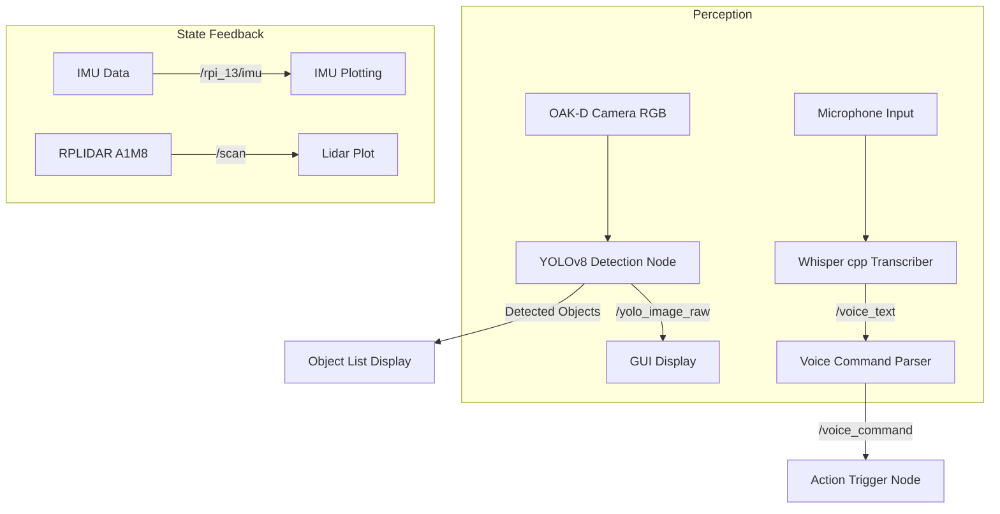

# Sensors & Real-Time Data Flow

This project relies on a variety of onboard sensors to perceive and interact with its environment. 
These sensors not only enable navigation and perception but also serve as core inputs to our real-time ROS2-based modular pipeline. 
Each sensor stream is visualized and processed in our GUI dashboard, allowing the system to respond interactively to the surroundings.

---

## Sensor Modalities & Data Interpretation 🔍 

### 1. Depth Camera (OAK-D Pro)
- Captures RGB and depth images.
- Used in conjunction with the YOLOv8 object detector node to identify objects.
- The depth stream is used to estimate proximity to detected objects.
- Raw image topic: `/oakd/rgb/preview/image_raw`
- Processed detections are visualized on the GUI and published to `/yolo_image_raw`.

### 2. LiDAR (RPLIDAR A1M8)
- Used for 360° spatial awareness and obstacle mapping.
- LaserScan data is subscribed via `/scan` topic.
- GUI radar plot visualizes real-time obstacles.
- Helps verify if the robot has a clear path before executing commands.

### 3. IMU
- Provides linear acceleration and angular velocity in 3D.
- Subscribed from `/rpi_13/imu` topic.
- Plotted as two separate graphs (Linear Acceleration and Angular Velocity) in GUI.
- Used for analyzing movement behavior, identifying drifts or unexpected turns.

### 4. Microphone (arecord)
- Records short audio bursts every 4 seconds.
- Whisper.cpp processes the waveform and outputs transcribed commands.
- Published to `/voice_text` and parsed by the `command_parser_node`.

---

## 📈 Real-Time Data Visualization Pipeline

Each of the sensors has a corresponding ROS2 subscriber and is rendered in the GUI dashboard as follows:

- Camera feed: live RGB image view.
- YOLOv8: overlaid bounding boxes and object labels.
- LiDAR: dynamic radar-style polar plot.
- IMU: scrollable X, Y, Z plots for both linear and angular data.
- Microphone: displays latest transcription + parsed command.

---

## Data Processing Pipeline

### **TurtleBot 4 Sensor Table**  

### **TurtleBot 4 Sensor Table**

| **Sensor**               | **Implementation**                              | **Sensor Image**                                                                                                                                  | **Corresponding Plot** |
|--------------------------|--------------------------------------------------|---------------------------------------------------------------------------------------------------------------------------------------------------|-------------------------|
| **Depth Camera – OAK-D-Pro** | Object detection and distance estimation           |                                              |  |
| **LiDAR – RPLIDAR A1M8**     | Environment mapping, object distance & navigation |                                                      |  |
| **IMU**                  | Motion state feedback and dynamic stabilization  |                                                             |  |
| **Microphone**           | Capturing user speech for transcription          |                                                      |  |

