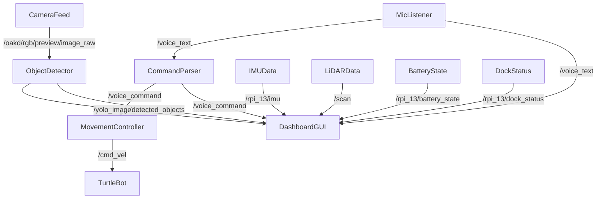

## BACKEND FRAMEWORK USING ROS2 

This project features a modular, ROS 2-based architecture that turns the TurtleBot4 + MyCobot arm into an intelligent mobile manipulator. The system supports real-time sensor processing, voice-guided navigation, object detection, and GUI-based interaction using custom ROS 2 nodes.

Key functionalities include:

- 🎯 YOLOv8-based object detection
- 🎤 Whisper.cpp-based speech transcription
- 📡 LiDAR-based environment sensing
- 📈 IMU-based robot state estimation
- 🖥️ Custom-built PyQt5 GUI to display real-time data
- 🤖 Integration-ready support for MyCobot arm manipulation

---

## ROS 2 Nodes & Their Responsibilities

1. `mic_listener_node`  
Records a short 4-second audio clip every few seconds and uses Whisper.cpp for on-device transcription. Publishes transcribed text to `/voice_text`.

2. `command_parser_node`  
Parses the text received from `/voice_text` and matches it against a list of valid commands. Converts recognized speech to structured instructions published on `/voice_command`.

3. `movement_controller_node`  
Executes motion commands based on `/voice_command`, translating them into `geometry_msgs/Twist` messages sent to `/cmd_vel`.

4. `object_detector_node`  
Subscribes to camera feed (`/oakd/rgb/preview/image_raw`), runs YOLOv8 in real time, and publishes an annotated image to `/yolo_image_raw` and a string summary to `/detected_objects`.

5. `web_dashboard_node`  
    PyQt5 GUI-based node that visualizes:
    - Camera feed
    - Object detection results
    - IMU acceleration and angular velocity plots
    - LiDAR scan as a radar map
    - Voice text, command log, and detected objects in live text feeds
6. Using ROS2 Actions:

    **Docking and Undocking Actions**
    
    As part of the robot's mobility and autonomy framework, we integrated basic ROS 2 action-based behaviors for:
    
    - ✅ Docking: Sending a goal to the Create 3 base to autonomously return to its dock station for charging.
    - 🔄 Undocking: Sending an undock goal to initiate departure from the charging dock and resume exploration.
    
    These actions were tested and triggered via GUI or voice commands. The docking state was also monitored using the /rpi_13/dock_status topic. This provides a critical capability for future long-duration missions where power management becomes essential.

---

## 🔁 Topics Overview

| Topic                        | Type                        | Description                                      |
|-----------------------------|-----------------------------|--------------------------------------------------|
| `/voice_text`               | `std_msgs/String`           | Transcribed text from mic                        |
| `/voice_command`            | `std_msgs/String`           | Parsed structured command                        |
| `/cmd_vel`                  | `geometry_msgs/Twist`       | Velocity command to TurtleBot                    |
| `/oakd/rgb/preview/image_raw` | `sensor_msgs/Image`        | RGB camera feed                                  |
| `/yolo_image_raw`           | `sensor_msgs/Image`         | Annotated YOLO output image                      |
| `/detected_objects`         | `std_msgs/String`           | Summary of objects seen                          |
| `/scan`                     | `sensor_msgs/LaserScan`     | LiDAR data used for obstacle proximity map       |
| `/rpi_13/imu`               | `sensor_msgs/Imu`           | IMU data for linear/angular tracking             |
| `/rpi_13/dock_status`       | `irobot_create_msgs/DockStatus` | Docking state                            |
| `/rpi_13/battery_state`     | `sensor_msgs/BatteryState`  | Live battery level info                          |

---

## Launch File

All nodes are launched via the voice control launch file:

```python
# voice_control.launch.py

- mic_listener_node
- command_parser_node
- movement_controller_node
- object_detector_node
- web_dashboard_node
```

To run:

```bash
ros2 launch voice_controlled_turtlebot voice_control.launch.py
```

---

## 🌐 GUI Architecture

The `web_dashboard_node` is a custom PyQt5 GUI that displays:

- Three camera areas (camera feed, YOLO output, and placeholder)
- Voice transcription, command parser log, and live object detection string
- LiDAR radar-style scan with red dots and TurtleBot center in green
- IMU plots for linear (X/Y/Z) and angular (X/Y/Z) data over time
- Docking state and battery level (subscribed internally, display optional)

---

## 🔄 ROS 2 Data Flow Diagram (Mermaid)



---

## Source Code & Installation 📁 

The full codebase is available at:  
➡️ [GitHub: voice_controlled_turtlebot](https://github.com/anushka002/voice_controlled_turtlebot)

To install and build:

```bash
cd ~/anu_ws/src
git clone https://github.com/voice_controlled_turtlebot.git
cd ..
colcon build
source install/setup.bash
```

To Run:
```
ros2 launch voice_controlled_turtlebot voice_control.launch.py
```
---

## 📦 External Tools Used

| Tool          | Description                                 | Version / Link                                |
|---------------|---------------------------------------------|-----------------------------------------------|
| YOLOv8        | Real-time object detection                  | [Ultralytics v8](https://github.com/ultralytics/ultralytics) |
| Whisper.cpp   | Lightweight CPU-based speech-to-text engine | [whisper.cpp](https://github.com/ggerganov/whisper.cpp) |
| PyQt5         | GUI framework for Python                    | PyQt5 (pip)                                    |
| OpenCV        | Image processing & visualization            | OpenCV 4.x                                     |

---

## MyCobot Robotic Arm Backend 

**Robot Arm Listener for ArUco Marker Detection**

This project uses a Python script to control a robotic arm by detecting ArUco markers in a camera feed. It leverages the ROS 2 framework and integrates with the `pymycobot` library to communicate with the robot arm.

### Overview

- **ROS 2**: The script subscribes to the `/camera_image_raw` topic, which streams live camera images.
- **ArUco Marker Detection**: The script detects ArUco markers in the images, calculates the marker's position in pixels, and uses inverse kinematics (IK) to compute the necessary joint angles for the robot arm to reach the marker's coordinates.
- **Robot Control**: The calculated joint angles are sent to the robot arm using the `pymycobot` library, which controls the physical movements of the robot arm.

### Prerequisites

Before running this code, ensure you have the following dependencies installed:

1. **ROS2**
2. **Python 3**
3. **OpenCV**: For ArUco marker detection and image processing.
4. **PyMyCobot**: Library to interface with the robotic arm.
5. **cv_bridge**: ROS 2 package to convert ROS image messages to OpenCV images.
6. **NumPy**: For mathematical computations.

Install dependencies using pip:

```bash
pip install opencv-python numpy pymycobot
```


