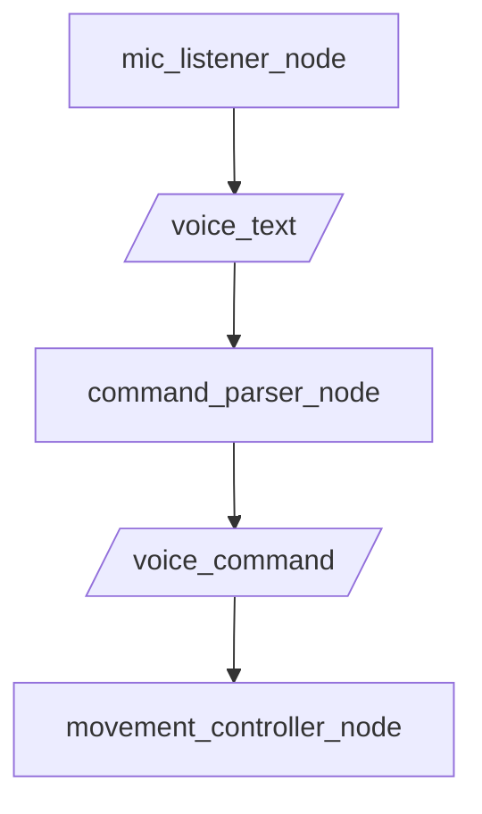

We implemented speech recognition on the TurtleBot4 system using Whisper.cpp – a lightweight, high-performance C++ implementation of OpenAI’s Whisper model. 
It enables voice-to-text transcription directly on-device, eliminating the need for cloud services and internet connectivity.

### How It Works 💬 

- The microphone on the host computer or external USB mic records a short audio clip (4 seconds).
- The audio is saved temporarily as a `.wav` file.
- Whisper.cpp processes this audio file using the `base.en` model to generate a transcription.
- The transcribed text is published to the ROS 2 topic `/voice_text`.

This node runs periodically and enables seamless integration of voice control into our ROS2 pipeline.

### 🛠️ Tradeoffs

- We initially tried online Whisper APIs, but due to computational load and latency, we switched to Whisper.cpp for real-time inference.
- Tiny model was fast but inaccurate for short commands. We upgraded to the base model for better transcription at the cost of minor latency.

### Live Demo 🧭

### ROS 2 Topics Used

- Subscribed: None
- Published: `/voice_text` (std_msgs/msg/String)

### ROS 2 Topic Flow 🧭 

